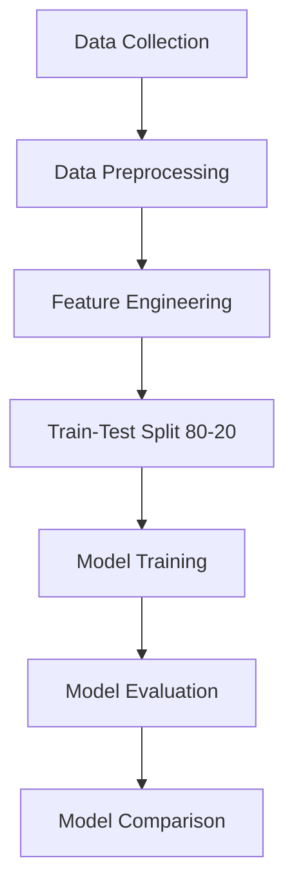

# 🎬 Movie Hit or Flop Prediction using Machine Learning

> Predict whether a movie will be a hit or flop before release using machine learning. The project uses IMDb, TMDb, and Box Office Mojo data, applies preprocessing, and compares Gradient Boosting, SVM, and Random Forest models to identify key success factors.

---

## 📝 Project Overview

This project leverages machine learning to predict the commercial success (**Hit** or **Flop**) of movies before their release. By analyzing a diverse set of features—including cast, director, genre, budget, and more—the models aim to support producers, investors, and marketers in making data-driven decisions and reducing financial risk.

---

## 📌 Objectives

- Collect and preprocess movie data from IMDb, TMDb, and Box Office Mojo
- Train and compare classification models: Gradient Boosting, Support Vector Machine (SVM), and Random Forest
- Identify key factors influencing a movie’s performance
- Evaluate models using Accuracy, Precision, Recall, F1-Score, and AUC

---

## 🔄 Methodology & Workflow



### 1. Data Collection 📥
Gathered movie data from multiple trusted sources (IMDb, TMDb, Box Office Mojo).

### 2. Preprocessing & Feature Engineering 🧹
- Handled missing values
- Encoded categorical features (genre, cast, director) using One-Hot Encoding
- Scaled numerical features
- Engineered new features (e.g., cast/director popularity, genre impact)

### 3. Train-Test Split 📂
Split data into 80% training and 20% testing sets.

### 4. Model Training 🛠
- Gradient Boosting: Sequential decision trees correcting previous errors
- SVM: Finds optimal hyperplane to separate "Hit" & "Flop"
- Random Forest: Combines multiple decision trees via majority voting

### 5. Evaluation & Comparison 📊🏆
Measured model performance on unseen test data using accuracy, precision, recall, F1-score, and AUC. Compared models to select the best performer.

---

## 💡 Novelty & Key Contributions

Unlike traditional approaches that focus mainly on revenue, budget, and ratings, this project incorporates early-stage predictive factors:

- 👥 Cast & Director Influence: Popularity and reputation impact audience interest
- 🎭 Genre Impact: Certain genres thrive despite low budgets
- Combination of numerical and categorical features for deeper pattern recognition

---

## 📊 Results

| Model               | Accuracy | AUC  |
|---------------------|----------|------|
| Gradient Boosting   | 0.85     | 0.87 |
| SVM                 | 0.79     | 0.79 |
| Random Forest       | **0.88** | **Best** |

🏆 **Random Forest** achieved the highest accuracy and most reliable performance across metrics.

---

## 📌 Key Takeaways

- Use diverse features for better early-stage prediction
- Ensemble methods like Random Forest often outperform individual models
- Good preprocessing and feature engineering are as important as the algorithm choice

---

## 📸 Example Output Chart

```mermaid
pie title Model Accuracy Comparison
    "Random Forest" : 88
    "Gradient Boosting" : 85
    "SVM" : 79
