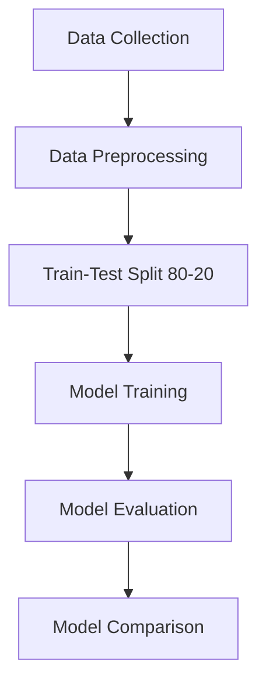

# 🎬 Movie Hit or Flop Prediction using Machine Learning  

> **Predict the success of a movie before its release using ML models**  

This project leverages **machine learning** to predict whether a movie will be a commercial **🎯 Hit** or a **💤 Flop** before its release.  
It aims to support **producers, investors, and marketing teams** in making informed decisions and reducing financial risks.  

---

## 📌 Objectives  
- 📊 **Collect & preprocess** movie data from IMDb, TMDb, and Box Office Mojo.  
- 🤖 **Train classification models** – Gradient Boosting, Support Vector Machine (SVM), and Random Forest.  
- 🔍 Identify **key factors** influencing a movie’s performance.  
- 📈 Evaluate models using **Accuracy, Precision, Recall, and F1-Score**.

---

## 🔄 Methodology  



---

## 🔄 Workflow  

### **Data Collection** 📥  
Gather relevant movie data from multiple trusted sources.

### **Preprocessing** 🧹  
- Handle missing values  
- Encode categorical features (genre, cast, etc.) using **One-Hot Encoding**  
- Scale numerical features  

### **Train-Test Split** 📂  
Split data into **80% training** and **20% testing**.

### **Model Training** 🛠  
- 🌱 **Gradient Boosting** – Builds sequential decision trees correcting previous errors.  
- 📏 **SVM** – Finds optimal hyperplane to separate "Hit" & "Flop".  
- 🌳 **Random Forest** – Combines multiple decision trees via majority voting.

### **Evaluation** 📊  
Measure model performance on unseen test data using accuracy, precision, recall, F1-score, and AUC.

### **Comparison** 🏆  
Identify the best performing model based on metrics.

---

## 💡 Novelty & Key Contributions  

Unlike previous approaches focusing mainly on revenue, budget, and ratings, this project incorporates **early-stage predictive factors**:  

- 👥 **Cast & Director Influence** – Popularity and reputation impact audience interest.  
- 🎭 **Genre Impact** – Certain genres thrive despite low budgets.  

By using **both numerical and categorical features**, our model captures deeper patterns for early-stage predictions.

---

## 📊 Results  

| Model               | Accuracy | AUC  |
|---------------------|----------|------|
| 🌱 Gradient Boosting | 0.85     | 0.87 |
| 📏 SVM               | 0.79     | 0.79 |
| 🌳 Random Forest     | **0.88** | **Best** |

**Winner:** 🏆 **Random Forest** — highest accuracy and reliable performance across metrics.

---

## 📌 Key Takeaways  
- 📂 Use **diverse features** for better early-stage prediction.  
- 🎯 Ensemble methods like **Random Forest** often outperform individual models.  
- 🛠 Good preprocessing and feature engineering are as important as the algorithm choice.

---

## 📸 Example Output Chart  

```mermaid
pie title Model Accuracy Comparison
    "Random Forest" : 88
    "Gradient Boosting" : 85
    "SVM" : 79
